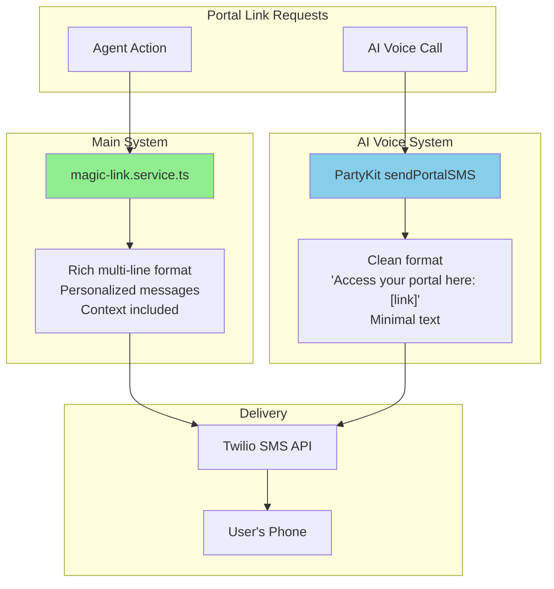

# 📱 **Portal Link Comparison: Main System vs AI Voice**

## 🔗 **Why Separate Services?**

Like the caller lookup separation, portal link sending is now independent for AI voice to:
- Maintain clean, simple messaging for voice interactions
- Avoid affecting production SMS templates
- Allow independent evolution of each system

## 📊 **Message Format Comparison**

### **Main System (Production)**

Used by agents and automated systems via main application:

```
Hi James,

Here's your secure portal link to access your motor finance claims: 
https://claim.resolvemyclaim.co.uk/claims?token=xyz123

This link expires in 24 hours.
```

**Characteristics:**
- Personalized greeting
- Descriptive context
- Expiry information
- Multi-line format

### **AI Voice System**

Used exclusively by AI voice calls:

```
Access your portal here: https://claim.resolvemyclaim.co.uk/claims?token=xyz123
```

**Characteristics:**
- Clean, minimal format
- No extra context (already discussed on call)
- Single line
- Direct and simple

## 🏗️ **Architecture Separation**



## ✅ **Benefits of Separation**

| Aspect | Benefit |
|--------|---------|
| **Message Control** | Each system uses appropriate format |
| **A/B Testing** | Can test different messages independently |
| **Monitoring** | Separate metrics for voice vs manual |
| **Compliance** | Different regulatory requirements possible |
| **Evolution** | Can enhance without affecting other system |

## 📈 **Implementation Details**

### **Main System Files**
- `modules/communications/services/magic-link.service.ts`
- `modules/ai-agents/actions/send-portal-link.action.ts`
- `modules/communications/services/sms.service.ts`

### **AI Voice Files**
- `modules/ai-voice-agent/services/ai-portal-link.service.ts` (created but not currently used)
- `partykit-voice/src/voice-party-fixed.ts` (direct implementation)

## 🎯 **When Each is Used**

| Scenario | System Used | Message Format |
|----------|------------|----------------|
| Agent clicks "Send Portal" | Main System | Rich, multi-line |
| SMS conversation requests link | Main System | Rich, multi-line |
| AI voice call requests link | AI Voice | Clean, single-line |
| Scheduled follow-up | Main System | Rich, multi-line |

## 💡 **Future Enhancements**

1. **Link Tracking**: Separate analytics for voice-initiated vs manual links
2. **Personalization**: AI could add context based on conversation
3. **Multi-channel**: AI voice could offer email option with different format
4. **Expiry Management**: Different expiry times for voice vs manual

---

**The systems are properly separated** - each optimized for its specific use case!
