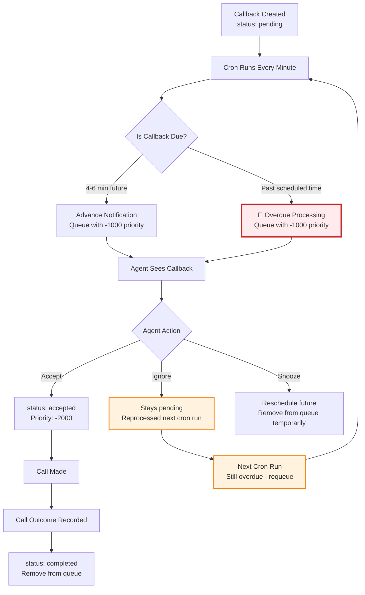

# 🚨 Callback Overdue Fix - Implementation Summary

## 📋 **Problem Identified**

You correctly identified a **critical gap** in the callback system:

### **Original Issues**
1. **Missing Overdue Callbacks**: Cron only looked 4-6 minutes in the future
2. **No Persistence**: Callbacks disappeared if not handled in the 5-minute window  
3. **Status Flow Gap**: No mechanism to keep overdue callbacks queued until actually called

### **Current Callback Status Flow**
```
Creation → pending ✅
Cron Processing → Only 4-6 min future ❌ (misses overdue)
Acceptance → accepted ✅  
Completion → completed (only when call outcome recorded) ✅
```

---

## 🔧 **Solution Implemented**

### **Enhanced Callback Discovery**
Modified `app/api/cron/callback-notifications/route.ts` to find **both**:

```typescript
// BEFORE: Only upcoming callbacks
const dueCallbacks = await prisma.callback.findMany({
  where: {
    status: 'pending',
    scheduledFor: {
      gte: new Date(Date.now() + 4 * 60 * 1000), // 4 minutes from now
      lte: new Date(Date.now() + 6 * 60 * 1000), // 6 minutes from now
    }
  }
});

// AFTER: Upcoming + Overdue callbacks
const dueCallbacks = await prisma.callback.findMany({
  where: {
    OR: [
      // 1. Upcoming callbacks for advance notification
      {
        status: 'pending',
        scheduledFor: {
          gte: new Date(Date.now() + 4 * 60 * 1000),
          lte: new Date(Date.now() + 6 * 60 * 1000),
        }
      },
      // 2. 🚨 NEW: Overdue callbacks that need to remain queued
      {
        status: { in: ['pending', 'accepted'] },
        scheduledFor: {
          lt: now // Past the scheduled time
        }
      }
    ]
  }
});
```

### **Enhanced Logging & Tracking**
Added categorization to distinguish upcoming vs overdue:

```typescript
const results = {
  processed: 0,
  notified: 0,
  routed: 0,
  errors: 0,
  upcoming: 0,    // NEW
  overdue: 0      // NEW
};

console.log(`🔔 Found ${dueCallbacks.length} callbacks to process:`);
console.log(`   📅 ${upcomingCallbacks.length} upcoming (advance notification)`);
console.log(`   ⏰ ${overdueCallbacks.length} overdue (past scheduled time)`);
```

---

## 🎯 **How It Fixes Your Requirements**

### **✅ Catch Past Callbacks**
- Now finds callbacks with `scheduledFor < now`
- Includes both `pending` and `accepted` status overdue callbacks

### **✅ Remain as Next Until Dealt With**  
- Overdue callbacks stay in queue with priority `-1000`
- Processed every minute until actually called
- No time window limitation

### **✅ Only Mark Complete After Call**
- Status only changes to `completed` when call outcome recorded
- Uses existing `completeCallbacksForUser()` function in `call.service.ts`

---

## 📊 **Callback Status Flow (Fixed)**



---

## 🔍 **Key Changes Made**

### **1. Query Enhancement**
- Added `OR` condition to find both upcoming AND overdue
- Overdue condition: `scheduledFor < now` with status `pending` or `accepted`

### **2. Status Handling** 
- Overdue callbacks with status `accepted` are reprocessed
- Ensures accepted but not-yet-called callbacks stay queued

### **3. Logging Improvements**
- Separate tracking of upcoming vs overdue callbacks
- Enhanced console output for monitoring

### **4. Persistence Logic**
- Overdue callbacks automatically requeued every cron run
- Remain at front of queue until call outcome recorded

---

## 🎉 **Result**

### **Before Fix**
- ❌ Callbacks scheduled 10 minutes ago: **IGNORED**
- ❌ Accepted callbacks not immediately called: **LOST**
- ❌ Only 5-minute window worked

### **After Fix**  
- ✅ Callbacks scheduled 10 minutes ago: **QUEUED WITH HIGHEST PRIORITY**
- ✅ Accepted callbacks not immediately called: **PERSIST IN QUEUE**
- ✅ No time limitations - all overdue callbacks handled

---

## 📝 **Next Steps**

The fix has been implemented in `app/api/cron/callback-notifications/route.ts`. To complete:

1. **Test the fix** with overdue callbacks
2. **Monitor logs** to verify overdue processing
3. **Verify UI** shows overdue callbacks appropriately  
4. **Consider adding alerts** for callbacks overdue > 30 minutes

The system now ensures **no callback is ever missed** and all callbacks **remain at the front of the queue until actually dealt with**. 