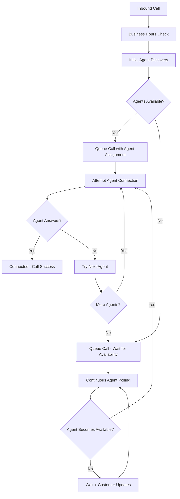

# 🎯 Inbound Call Model Improvement Plan

## 📋 Executive Summary

**Objective**: Transform the current single-attempt inbound call routing into a robust queue-based system with continuous agent discovery and multi-agent fallback capabilities.

**Current Problem**: Inbound calls fail when agents don't answer within 30 seconds, resulting in missed opportunities and poor customer experience.

**Proposed Solution**: Implement a queue-based holding pattern with real-time agent availability tracking and automatic retry mechanisms.

---

## 🔍 Current State Analysis

### **Critical Issues Identified**

1. **Inaccurate Agent Availability**
   - Database status `'available'` ≠ Actually ready to take calls
   - No validation of Twilio device connectivity
   - No real-time heartbeat system

2. **Single-Point-of-Failure Architecture**
   - One dial attempt per call
   - 30-second timeout = call lost
   - No fallback to other agents

3. **Poor Customer Experience**
   - Immediate hang-up on agent unavailability
   - No holding pattern or queue position updates
   - No escalation mechanisms

4. **Missing Business Logic**
   - No retry when agents finish other calls
   - No priority-based routing
   - No load balancing across available agents

---

## 🏗️ Proposed Solution Architecture

### **Core Components**



### **Key Architectural Changes**

1. **Queue-First Approach**: All inbound calls enter a queue system
2. **Continuous Polling**: Background service monitors agent availability
3. **Multi-Agent Fallback**: Sequential attempts across all available agents
4. **Real-Time Validation**: Verify agent device connectivity before routing
5. **Customer Experience**: Hold music, position updates, estimated wait times

---

## 🛠️ Implementation Plan

### **Phase 1: Enhanced Agent Availability Tracking**
*Duration: 1-2 weeks*

#### **Components to Build**

1. **Real-Time Agent Heartbeat System**
   ```typescript
   // New service: modules/agents/services/agent-heartbeat.service.ts
   export class AgentHeartbeatService {
     async updateHeartbeat(agentId: number): Promise<void>
     async getOnlineAgents(): Promise<Agent[]>
     async markAgentOffline(agentId: number): Promise<void>
   }
   ```

2. **Twilio Device Connectivity Checker**
   ```typescript
   // New service: modules/twilio-voice/services/device-connectivity.service.ts
   export class DeviceConnectivityService {
     async isDeviceConnected(agentId: number): Promise<boolean>
     async validateAgentReadiness(agentId: number): Promise<AgentReadiness>
   }
   ```

3. **Enhanced Agent Discovery**
   ```typescript
   // Update: modules/twilio-voice/services/inbound-call-handler.service.ts
   async function findTrulyAvailableAgents(): Promise<ValidatedAgent[]> {
     // 1. Database availability check
     // 2. Heartbeat validation  
     // 3. Twilio device connectivity
     // 4. Current call load check
   }
   ```

#### **Database Changes**
```sql
-- Add heartbeat tracking to agent_sessions
ALTER TABLE agent_sessions ADD COLUMN last_heartbeat TIMESTAMP;
ALTER TABLE agent_sessions ADD COLUMN device_connected BOOLEAN DEFAULT FALSE;
ALTER TABLE agent_sessions ADD COLUMN max_concurrent_calls INT DEFAULT 1;
```

#### **Risks & Mitigations**
- **Risk**: Performance impact from frequent heartbeat checks
  - *Mitigation*: Implement efficient caching with Redis, 30-second intervals
- **Risk**: False positives on device connectivity
  - *Mitigation*: Implement retry logic with exponential backoff
- **Risk**: Existing agent login flow disruption
  - *Mitigation*: Backward-compatible changes, feature flags

---

### **Phase 2: Queue-Based Call Holding System**
*Duration: 2-3 weeks*

#### **Components to Build**

1. **Call Queue Management Service**
   ```typescript
   // New service: modules/call-queue/services/inbound-call-queue.service.ts
   export class InboundCallQueueService {
     async enqueueCall(callInfo: InboundCallInfo): Promise<QueuePosition>
     async dequeueNextCall(): Promise<QueuedCall | null>
     async updateQueuePosition(callSid: string): Promise<void>
     async getEstimatedWaitTime(): Promise<number>
   }
   ```

2. **Queue-Based TwiML Response**
   ```xml
   <!-- New TwiML structure -->
   <Response>
     <Play>welcome_message.mp3</Play>
     <Enqueue action="/api/webhooks/twilio/queue-handler" 
              waitUrl="/api/webhooks/twilio/queue-hold-music">
       <Task>{"caller_info": "..."}</Task>
     </Enqueue>
   </Response>
   ```

3. **Hold Music & Customer Updates**
   ```typescript
   // New endpoint: app/api/webhooks/twilio/queue-hold-music/route.ts
   export async function POST(request: NextRequest) {
     // Provide hold music with periodic position updates
     // "You are caller number X in line. Estimated wait time: Y minutes"
   }
   ```

#### **Database Changes**
```sql
-- New table for call queue management
CREATE TABLE inbound_call_queue (
  id BIGINT PRIMARY KEY AUTO_INCREMENT,
  twilio_call_sid VARCHAR(255) UNIQUE NOT NULL,
  caller_phone VARCHAR(20) NOT NULL,
  caller_name VARCHAR(255),
  user_id BIGINT,
  priority_score INT DEFAULT 0,
  queue_position INT,
  estimated_wait_seconds INT,
  entered_queue_at TIMESTAMP DEFAULT CURRENT_TIMESTAMP,
  assigned_to_agent_id INT,
  assigned_at TIMESTAMP,
  status ENUM('waiting', 'assigned', 'connecting', 'connected', 'abandoned') DEFAULT 'waiting',
  attempts_count INT DEFAULT 0,
  last_attempt_at TIMESTAMP,
  created_at TIMESTAMP DEFAULT CURRENT_TIMESTAMP,
  updated_at TIMESTAMP DEFAULT CURRENT_TIMESTAMP ON UPDATE CURRENT_TIMESTAMP,
  INDEX idx_status_priority (status, priority_score),
  INDEX idx_queue_position (queue_position),
  INDEX idx_caller_phone (caller_phone)
);
```

#### **Risks & Mitigations**
- **Risk**: Twilio queue limits and costs
  - *Mitigation*: Implement smart queue management, monitor usage closely
- **Risk**: Customer abandonment during hold
  - *Mitigation*: Optimize wait times, provide clear updates, offer callback options
- **Risk**: Queue state inconsistency
  - *Mitigation*: Use database transactions, implement queue reconciliation jobs

---

### **Phase 3: Continuous Agent Discovery & Auto-Assignment**
*Duration: 2-3 weeks*

#### **Components to Build**

1. **Background Agent Polling Service**
   ```typescript
   // New service: modules/call-queue/services/agent-polling.service.ts
   export class AgentPollingService {
     async startPolling(): Promise<void>
     async checkForAvailableAgents(): Promise<void>
     async assignCallToAgent(queuedCall: QueuedCall, agent: Agent): Promise<void>
     async handleFailedAssignment(queuedCall: QueuedCall): Promise<void>
   }
   ```

2. **Queue Worker Process**
   ```typescript
   // New cron job: app/api/cron/inbound-queue-processor/route.ts
   export async function GET(request: NextRequest) {
     // Runs every 10 seconds
     // 1. Find queued calls waiting for agents
     // 2. Discover newly available agents
     // 3. Attempt call assignments
     // 4. Handle failed connections
   }
   ```

3. **Multi-Agent Fallback Logic**
   ```typescript
   // Update: modules/twilio-voice/services/call-assignment.service.ts
   export class CallAssignmentService {
     async attemptAgentConnection(call: QueuedCall, agents: Agent[]): Promise<boolean>
     async rotateToNextAgent(call: QueuedCall): Promise<void>
     async handleAllAgentsUnavailable(call: QueuedCall): Promise<void>
   }
   ```

#### **System Architecture**
```
┌─────────────────┐    ┌──────────────────┐    ┌─────────────────┐
│  Inbound Call   │ -> │   Call Queue     │ -> │ Agent Polling   │
│   Handler       │    │   Management     │    │   Service       │
└─────────────────┘    └──────────────────┘    └─────────────────┘
                              │                          │
                              v                          v
                    ┌──────────────────┐    ┌─────────────────┐
                    │ Queue Database   │    │ Available       │
                    │ (Position,       │    │ Agents Pool     │
                    │  Wait Times)     │    │                 │
                    └──────────────────┘    └─────────────────┘
```

#### **Risks & Mitigations**
- **Risk**: Race conditions in agent assignment
  - *Mitigation*: Database locks, atomic transactions, assignment timeouts
- **Risk**: Infinite loops with problematic agents
  - *Mitigation*: Agent blacklisting, exponential backoff, circuit breakers
- **Risk**: Performance degradation from frequent polling
  - *Mitigation*: Efficient queries, connection pooling, monitoring

---

### **Phase 4: Advanced Features & Optimization**
*Duration: 1-2 weeks*

#### **Components to Build**

1. **Priority-Based Queue Management**
   ```typescript
   // Enhanced queuing with VIP customers, callback requests, etc.
   export class PriorityQueueService {
     async calculatePriority(caller: CallerInfo): Promise<number>
     async reorderQueue(): Promise<void>
     async handleVIPCaller(caller: CallerInfo): Promise<void>
   }
   ```

2. **Smart Load Balancing**
   ```typescript
   // Distribute calls based on agent performance, availability, etc.
   export class LoadBalancingService {
     async selectOptimalAgent(availableAgents: Agent[]): Promise<Agent>
     async updateAgentLoadMetrics(agentId: number): Promise<void>
   }
   ```

3. **Callback Request System**
   ```typescript
   // Allow customers to request callbacks instead of waiting
   export class CallbackRequestService {
     async offerCallback(queuedCall: QueuedCall): Promise<void>
     async scheduleCallback(callbackRequest: CallbackRequest): Promise<void>
   }
   ```

#### **Risks & Mitigations**
- **Risk**: Feature complexity overwhelming system
  - *Mitigation*: Phased rollout, feature flags, extensive testing
- **Risk**: Priority system creating unfairness
  - *Mitigation*: Clear business rules, monitoring, customer communication

---

## 🏗️ Build Strategy

### **Development Approach**

1. **Incremental Implementation**
   - Each phase can be developed and tested independently
   - Feature flags for gradual rollout
   - Fallback to current system if issues arise

2. **Testing Strategy**
   ```typescript
   // Unit Tests
   - Agent availability detection
   - Queue management logic
   - Priority calculations
   
   // Integration Tests  
   - End-to-end call flow
   - Multi-agent failover
   - Queue state consistency
   
   // Load Tests
   - High-volume inbound calls
   - Agent availability changes
   - Queue performance under stress
   ```

3. **Monitoring & Observability**
   ```typescript
   // Key Metrics to Track
   - Average wait time in queue
   - Agent utilization rates
   - Call abandonment rates
   - First-attempt connection success rate
   - Queue length over time
   ```

### **Database Migration Strategy**

1. **Backward Compatibility**
   - New tables alongside existing structure
   - Gradual migration of call handling logic
   - Preserve existing call session data

2. **Data Migration Plan**
   ```sql
   -- Phase 1: Add new columns to existing tables
   -- Phase 2: Create new queue management tables  
   -- Phase 3: Migrate historical data for analytics
   -- Phase 4: Clean up deprecated columns
   ```

### **Deployment Strategy**

1. **Feature Flag Implementation**
   ```typescript
   // lib/config/features.ts
   export const FEATURES = {
     ENHANCED_INBOUND_QUEUE: process.env.FEATURE_ENHANCED_QUEUE === 'true',
     AGENT_HEARTBEAT: process.env.FEATURE_AGENT_HEARTBEAT === 'true',
     MULTI_AGENT_FALLBACK: process.env.FEATURE_MULTI_AGENT === 'true'
   };
   ```

2. **Gradual Rollout**
   - Start with 10% of inbound calls
   - Monitor success metrics
   - Gradually increase to 100%
   - Immediate rollback capability

---

## ⚠️ Risk Analysis & Mitigation Strategies

### **High-Risk Areas**

1. **Twilio Cost Escalation**
   - **Risk**: Queue holding increases call duration and costs
   - **Mitigation**: 
     - Implement maximum hold time limits (5-10 minutes)
     - Offer callback options after threshold
     - Monitor costs with alerts

2. **System Complexity**
   - **Risk**: Multiple moving parts increase failure points
   - **Mitigation**:
     - Comprehensive error handling
     - Circuit breakers for external services
     - Fallback to simplified routing

3. **Race Conditions**
   - **Risk**: Multiple calls assigned to same agent
   - **Mitigation**:
     - Database-level constraints
     - Optimistic locking
     - Assignment timeouts

4. **Performance Degradation**
   - **Risk**: Frequent polling and queue checks slow system
   - **Mitigation**:
     - Efficient database queries with proper indexing
     - Redis caching for agent availability
     - Connection pooling

### **Medium-Risk Areas**

1. **Customer Experience**
   - **Risk**: Long hold times frustrate customers
   - **Mitigation**:
     - Clear wait time estimates
     - Regular position updates
     - Engaging hold content

2. **Agent Workflow Disruption**
   - **Risk**: New system confuses existing agents
   - **Mitigation**:
     - Gradual training rollout
     - Backward compatibility
     - Clear documentation

3. **Data Consistency**
   - **Risk**: Queue state becomes inconsistent
   - **Mitigation**:
     - Transaction-based updates
     - Periodic reconciliation jobs
     - Monitoring and alerting

### **Low-Risk Areas**

1. **Integration Complexity**
   - **Risk**: Twilio API changes break integration
   - **Mitigation**:
     - API versioning
     - Comprehensive testing
     - Vendor communication

---

## 📊 Success Criteria

### **Key Performance Indicators (KPIs)**

1. **Call Success Rate**
   - Target: >95% of inbound calls connect to agents
   - Current: ~70-80% (estimated based on issues)

2. **Average Wait Time**
   - Target: <2 minutes average hold time
   - Maximum: 10 minutes before callback offer

3. **Customer Satisfaction**
   - Target: Reduce call abandonment by 50%
   - Measure: Post-call surveys, customer feedback

4. **Agent Utilization**
   - Target: >85% agent utilization during business hours
   - Balance: Avoid agent burnout

5. **System Reliability**
   - Target: 99.9% uptime for call routing system
   - Response time: <2 seconds for call processing

### **Business Impact Metrics**

1. **Revenue Protection**
   - Estimate: Each missed call = $X potential revenue
   - Target: Reduce missed call revenue loss by 80%

2. **Operational Efficiency**
   - Reduce manual callback management
   - Improve agent productivity
   - Better capacity planning

---

## 📅 Implementation Timeline

### **Phase 1: Enhanced Agent Availability (Weeks 1-2)**
- Week 1: Heartbeat system development
- Week 2: Device connectivity checker, testing

### **Phase 2: Queue System (Weeks 3-5)**
- Week 3: Database design, basic queue service
- Week 4: TwiML integration, hold music system
- Week 5: Testing and optimization

### **Phase 3: Continuous Discovery (Weeks 6-8)**
- Week 6: Polling service development
- Week 7: Multi-agent fallback logic
- Week 8: Integration testing

### **Phase 4: Advanced Features (Weeks 9-10)**
- Week 9: Priority queuing, load balancing
- Week 10: Callback system, final testing

### **Production Rollout (Weeks 11-12)**
- Week 11: Feature flag deployment, 10% traffic
- Week 12: Full rollout, monitoring, optimization

---

## 🔧 Technical Implementation Notes

### **Critical Code Changes Required**

1. **Update Inbound Call Handler**
   ```typescript
   // modules/twilio-voice/services/inbound-call-handler.service.ts
   // Replace direct agent dialing with queue-first approach
   ```

2. **New Queue Management Endpoints**
   ```typescript
   // app/api/webhooks/twilio/queue-handler/route.ts
   // app/api/webhooks/twilio/queue-hold-music/route.ts
   ```

3. **Background Processing Service**
   ```typescript
   // app/api/cron/inbound-queue-processor/route.ts
   // Continuous agent discovery and assignment
   ```

### **Infrastructure Requirements**

1. **Database Optimization**
   - Additional indexes for queue queries
   - Connection pool tuning
   - Query optimization

2. **Monitoring Setup**
   - Queue length metrics
   - Agent availability tracking
   - Call success rate monitoring
   - Performance dashboards

3. **Alerting System**
   - High queue length alerts
   - Agent availability warnings
   - System performance degradation

---

## 📈 Long-Term Considerations

### **Scalability Planning**

1. **Growth Accommodation**
   - Design for 10x current call volume
   - Horizontal scaling capabilities
   - Database sharding strategies

2. **Feature Evolution**
   - AI-powered agent selection
   - Predictive wait time estimation
   - Integration with CRM systems

3. **Performance Optimization**
   - Caching strategies
   - Database optimization
   - Network latency reduction

### **Maintenance Strategy**

1. **Regular Reviews**
   - Monthly performance analysis
   - Quarterly system optimization
   - Annual architecture review

2. **Documentation Maintenance**
   - Update technical documentation
   - Maintain runbooks
   - Keep training materials current

---

## ✅ Next Steps

1. **Immediate Actions**
   - Review and approve this implementation plan
   - Allocate development resources
   - Set up project tracking

2. **Pre-Development Setup**
   - Create feature flags
   - Set up monitoring infrastructure
   - Prepare testing environments

3. **Development Kickoff**
   - Begin Phase 1 implementation
   - Establish daily standups
   - Set up continuous integration

---

*This plan provides a comprehensive roadmap for transforming the inbound call system from a brittle single-attempt model to a robust, queue-based system that ensures customer calls are answered by available agents.* 