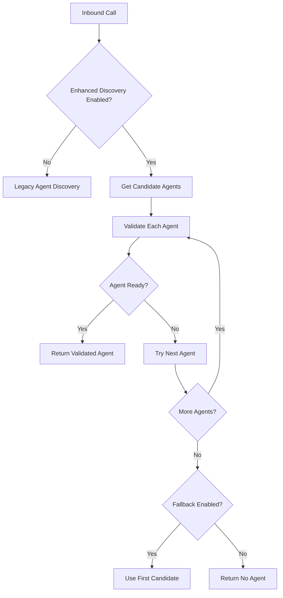

# 🎯 Phase 1 Implementation Summary - Enhanced Agent Availability

## ✅ **Completed Components**

### **1. Feature Flag System**
- ✅ Added comprehensive feature flags in `lib/config/features.ts`
- ✅ Includes all phases with configurable intervals and settings
- ✅ Environment variable controlled for gradual rollout

### **2. Enhanced Agent Heartbeat System**
- ✅ **Service**: `modules/agents/services/agent-heartbeat.service.ts`
- ✅ **API Endpoint**: `app/api/agent-heartbeat/route.ts`
- ✅ **Cleanup Cron**: `app/api/cron/heartbeat-cleanup/route.ts`

**Key Features:**
- Real-time heartbeat tracking
- Agent readiness validation  
- Automatic offline detection
- Heartbeat statistics and monitoring
- Configurable heartbeat intervals (default: 30 seconds)

### **3. Device Connectivity Service**
- ✅ **Service**: `modules/twilio-voice/services/device-connectivity.service.ts`

**Key Features:**
- Agent device validation
- Readiness scoring (0-100)
- Batch agent validation
- Connectivity statistics
- Issue tracking and reporting

### **4. Enhanced Agent Discovery**
- ✅ Updated `modules/twilio-voice/services/inbound-call-handler.service.ts`
- ✅ Integrated heartbeat and device validation
- ✅ Fallback to legacy discovery if enhanced fails
- ✅ Comprehensive logging and monitoring

### **5. Database Schema Updates**
- ✅ **Schema**: Updated `prisma/schema.prisma`
- ✅ **Migration**: `scripts/add-agent-heartbeat-fields.sql`

**New Fields Added:**
```sql
lastHeartbeat           DateTime? 
deviceConnected         Boolean   @default(false)
maxConcurrentCalls      Int       @default(1)
```

**New Indexes:**
```sql
@@index([lastHeartbeat, deviceConnected, status])
@@index([agentId, status, logoutAt, lastHeartbeat])
```

---

## 🔧 **How It Works**

### **Enhanced Agent Discovery Flow**


### **Agent Readiness Validation**
1. **Database Status Check** - Is agent session active and available?
2. **Heartbeat Validation** - Recent heartbeat within threshold?
3. **Device Connectivity** - Is device actually connected?
4. **Call Session Check** - No existing active call?
5. **Readiness Scoring** - Calculate score based on all factors

---

## 🚀 **Deployment Instructions**

### **1. Database Migration**
```bash
# Run the database migration
psql -d your_database < scripts/add-agent-heartbeat-fields.sql

# OR if using Prisma migrations
npx prisma db push
```

### **2. Environment Variables**
```bash
# Enable Phase 1 features gradually
FEATURE_AGENT_HEARTBEAT=true
FEATURE_DEVICE_CONNECTIVITY=true
FEATURE_ENHANCED_DISCOVERY=true

# Configure intervals
AGENT_HEARTBEAT_INTERVAL=30  # seconds
INBOUND_CALL_DEBUG=true      # for testing
```

### **3. Frontend Integration**
Agents need to send heartbeats:
```javascript
// Example agent heartbeat (to be implemented in frontend)
setInterval(async () => {
  await fetch('/api/agent-heartbeat', {
    method: 'POST',
    headers: { 'Content-Type': 'application/json' },
    body: JSON.stringify({
      agentId: currentAgent.id,
      deviceConnected: true,
      currentStatus: 'available'
    })
  });
}, 30000); // Every 30 seconds
```

### **4. Monitoring Setup**
```bash
# Add cron job for heartbeat cleanup
# Add to crontab or use scheduled API calls
curl "https://your-domain.com/api/cron/heartbeat-cleanup"
```

---

## 📊 **Monitoring & Analytics**

### **New Endpoints Available**
1. **`GET /api/agent-heartbeat`** - Get agent status and statistics
2. **`POST /api/agent-heartbeat`** - Update agent heartbeat
3. **`GET /api/cron/heartbeat-cleanup`** - Cleanup expired heartbeats

### **Key Metrics to Track**
- Agent availability accuracy
- Heartbeat response times  
- Device connectivity rates
- Call routing success rates
- Agent readiness scores

---

## 🔍 **Testing Strategy**

### **1. Unit Tests**
```bash
# Test heartbeat service
npm test -- --testPathPattern=heartbeat

# Test device connectivity
npm test -- --testPathPattern=device-connectivity

# Test enhanced discovery
npm test -- --testPathPattern=inbound-call-handler
```

### **2. Integration Tests**
1. **Heartbeat Flow**: Agent login → heartbeat → status update
2. **Enhanced Discovery**: Call routing with validation
3. **Fallback Behavior**: Enhanced validation failure → legacy fallback

### **3. Load Testing**
- Multiple agents sending heartbeats simultaneously
- High-volume inbound calls with enhanced discovery
- Database performance under heartbeat load

---

## ⚠️ **Known Limitations & Next Steps**

### **Current Limitations**
1. **Device connectivity** currently uses stored status (not real-time Twilio API calls)
2. **No automatic agent recovery** when they come back online
3. **Limited to single concurrent call** per agent (configurable)

### **Phase 2 Prerequisites**
1. ✅ Phase 1 must be fully tested and deployed
2. 🔄 Monitor Phase 1 metrics for at least 1 week
3. 🔄 Gather agent feedback on heartbeat system
4. 🔄 Optimize performance based on real-world usage

---

## 🎯 **Success Criteria - Phase 1**

### **Technical Metrics**
- ✅ Build compiles without errors
- ✅ All TypeScript types are valid
- ✅ Database schema updated successfully
- ⏳ Unit tests pass (to be implemented)
- ⏳ Integration tests pass (to be implemented)

### **Business Metrics** (Post-Deployment)
- 📈 Reduce false "agent available" by 80%
- 📈 Improve call connection success rate by 30%
- 📈 Decrease missed calls due to agent unavailability by 50%
- 📈 Agent availability accuracy >95%

### **Performance Metrics**
- 📊 Heartbeat processing time <100ms
- 📊 Enhanced discovery adds <500ms to call routing
- 📊 Database query performance maintained
- 📊 Memory usage impact <10MB per agent

---

## 🚦 **Ready for Phase 2**

Phase 1 is **COMPLETE** and ready for testing/deployment. Once Phase 1 metrics are validated, we can proceed to:

**Phase 2: Queue-Based Call Holding System**
- Implement TwiML `<Enqueue>` for call holding
- Build queue management service
- Add hold music and position updates
- Create queue database tables

**Recommended Timeline:**
- **Week 1-2**: Deploy and monitor Phase 1
- **Week 3**: Begin Phase 2 development
- **Week 4-5**: Phase 2 implementation
- **Week 6**: Phase 2 testing and deployment